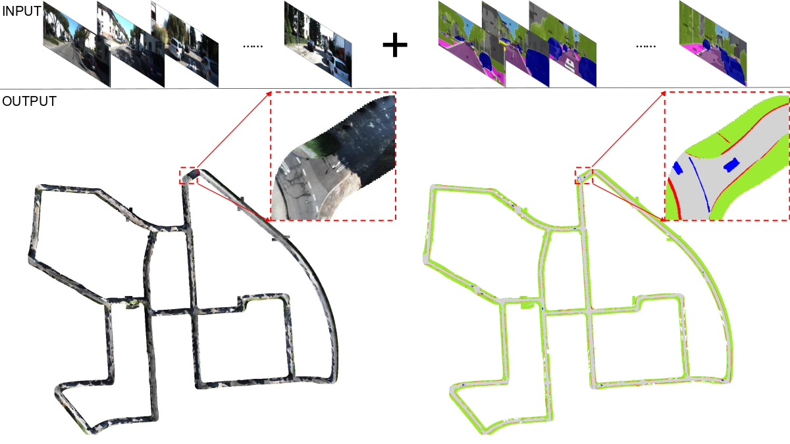

# RoMe: Towards Large Scale Road Surface Reconstruction via Mesh Representation

### [Paper](https://arxiv.org/abs/2306.11368),[YouTube](https://youtu.be/S7ZEMVaEtBA), [Bilibili](https://www.bilibili.com/video/BV1Xx4y1o7ea/?vd_source=5051310ed13090afc35ea319bbc5cac3)
### Ruohong Mei, Wei Sui, Jiaxin Zhang, Xue Qin, Gang Wang, Tao Peng, Cong Yang
<p align="center">
  
</p>

### [nuScenes](https://www.nuscenes.org/nuscenes)

In configs/local_nusc.yaml

* base_dir: Put official nuScenes here, e.g. {base_dir}/v1.0-trainval
* image_dir: Put segmentation results here. We use [Mask2Former](https://bowenc0221.github.io/mask2former/) to segment source images. Folder structure is like {image_dir}/{sweeps/samples}/seg_CAM_FRONT. We provide processed data on [google drive](https://drive.google.com/file/d/1WpHu4qa9r1WNmwGFqzY5nv9PMCfwUVOn/view), including all semantic images used in this paper. "Scene-1" and "Scene-2" of the paper contain ```scene-0063, scene-0064, scene-0200, scene-0283``` and ```scene-0109, scene-0508, scene-0523, scene-0821``` respectively.

### [KITTI Odom](https://www.cvlibs.net/datasets/kitti/eval_odometry.php)

In configs/local_kitti.yaml

* base_dir: Put official kitti odometry dataset here, e.g. {base_dir}/sequences
* image_dir: Put segmentation results here. Also we use Mask2Former and folder structure is like {image_dir}/seg_sequences. We provide processed data on [google drive](https://drive.google.com/file/d/1tSgxztLtN3vu1mocfLA0rHsURF8zW6uW/view?usp=sharing), including all semantic images and poses we used.

### Quick Start

#### Environment

```
torch==1.10.2+cu111
torchvision==0.11.3+cu111
torchaudio==0.10.2+cu111
pytorch3d==0.6.1
pymeshlab==2021.10 
scipy opencv-py thon tqdm wandb python3.8
```

For wandb usage, please visit [here](https://wandb.ai/site).

#### Train a scene from nuScenes

* Modify ```configs/local_nusc.yaml```
  
  * change wandb configs
  * change ```base_dir``` and ```image_dir``` according to your folder
  * change ```clip_list``` to train one scene or multiple scenes.
* Modify wandb url and api_key in ```run_local.sh``` and then run ```sh run_local.sh``` to start training.

#### Train a scene from KITTI

* Modify ```configs/local_kitti.yaml```
  
  * change wandb configs
  * change ```base_dir``` and ```image_dir``` according to your folder
  * change ```sequence``` to choose which sequence to train.
  * modify ````choose_point```` and ```bev_x/y_length``` to choose which sub area to train.
* Modify wandb url and api_key in ```run_local.sh``` and then run ```sh run_local.sh``` to start training.

#### Evaluation

* Modify ```configs/nusc_eval.yaml```
  * change ```model_path```and ```pose_path``` where your trained models saved.
  * Make sure other training parameters are same as your configs when training.
  * This is a simple evaluation script and only support ```batch_size: 1```

### Future work

* This is the first version of RoMe, and it is hard to reconstruct steep slopes.
* Using SfM(structure from motion) or MVS(multi-view stereo) points and lidar points will give strong supervision.
* Monodepth estimation would be useful like [monosdf](https://github.com/autonomousvision/monosdf).
* We are trying to use other mesh render methods like [nvdiffrec](https://nvlabs.github.io/nvdiffrec/).


### Citation

```
@misc{mei2023rome,
      title={RoMe: Towards Large Scale Road Surface Reconstruction via Mesh Representation}, 
      author={Ruohong Mei and Wei Sui and Jiaxin Zhang and Qian Zhang and Tao Peng and Cong Yang},
      year={2023},
      eprint={2306.11368},
      archivePrefix={arXiv},
      primaryClass={cs.CV}
}
```
